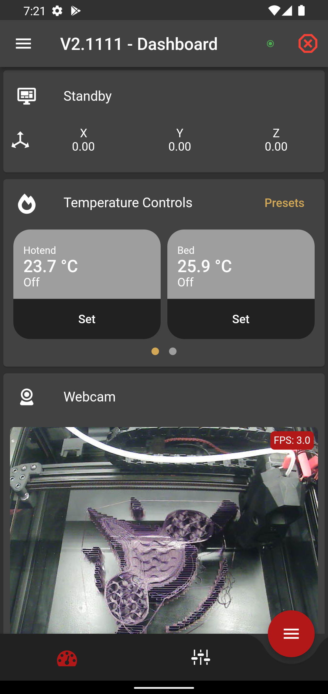
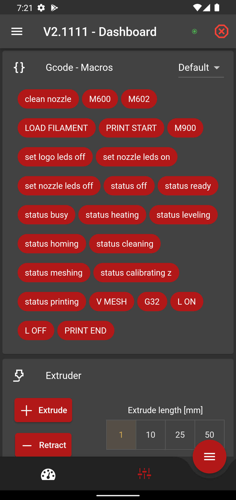
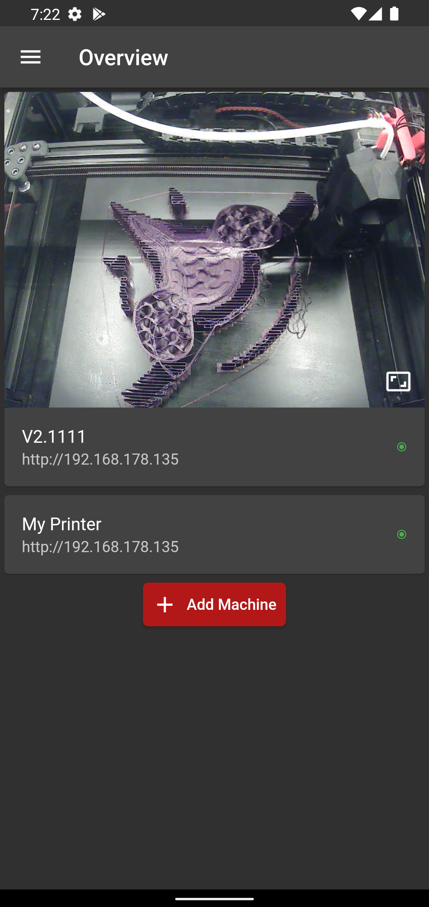
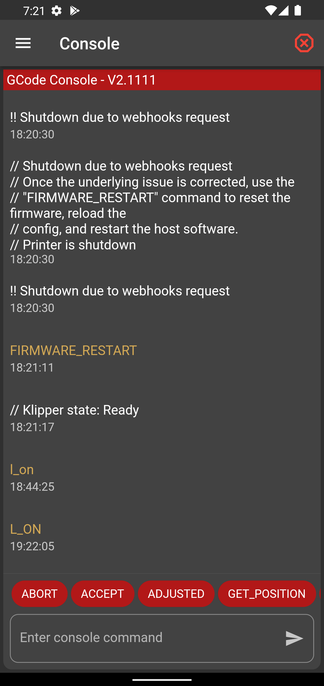
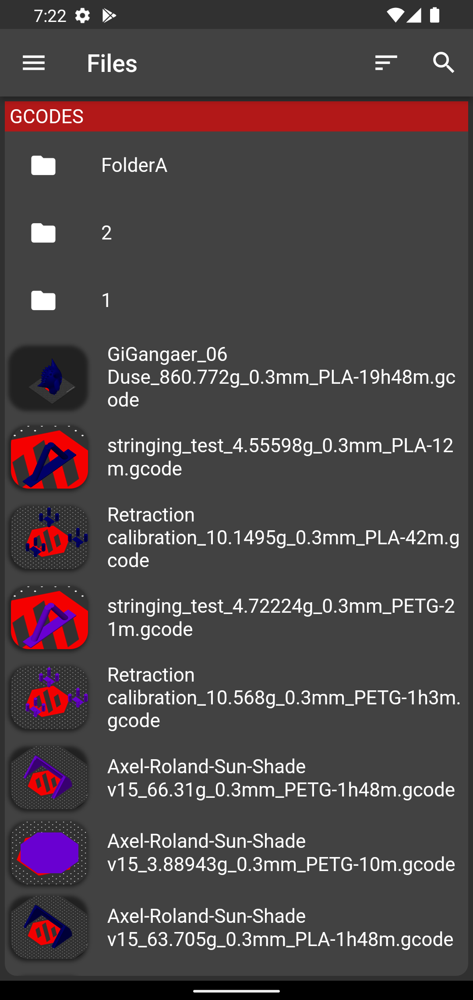
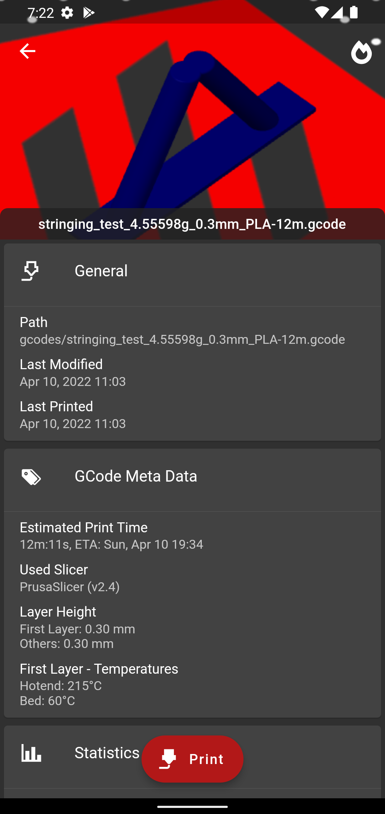

# Mobileraker

Get Mobileraker now:  

---

🏷️ Mobileraker works as a simple UI for Klipper on the phone. Connect it to an existing moonraker installation and control the printer.

🧰  With Mobileraker, the user has access to critical machine commands:
- Pause, Resume, Stop a print job
- Monitor the print progress
- Control all axis of the machine
- Control the heaters
- Get the current temperature readings
- Control fans
- Control pins like LEDs
- Send GCode Macros
- Emergency Stop the machine

🛠️  Additionally, Mobileraker enables the user to monitor the machine via an integrated webcam viewer with support for multiple cams, interact with the machine through the GCode console and browse the available GCode files to start a new print job.
Mobileraker also offers comfort features like remote push notifications about the progress of a print job, temperature presets.

✨  One more thing ...
Mobileraker can manage multiple machines!

✍🏻  Some final words from the project owner:
Hi,
My name is Patrick Schmidt, and I am the developer of Mobileraker. Mobileraker started as a small side project with the intention to be able to control My 3D printer via My phone. After posting some screenshots of the app to the 3D printing community, the public interest in Mobileraker grew, and I published it to the app stores.
As I am only able to work on Mobileraker in my free time, I am always thankful for support and feedback. Either via lovely messages of people enjoying Mobileraker, good reviews in the store or through donations. I hope you enjoy Mobileraker and happy printing 🙏!

## Support me
Want to support me?

## Push Notifications / Remote Notification
In order to use remote notifications be sure to follow the setup guide to install [Mobileraker's Companion](https://github.com/Clon1998/mobileraker_companion) for Klipper/Moonraker.

## App Screenshots

|                    Dashboard - Dash                     |                   Dashboard - Controls                    |
|:-------------------------------------------------------:|:---------------------------------------------------------:|
|  |   |
|              Overview - Multiple Printers               |                      GCode - Console                      |
|   |      |
|                   GCode File Browser                    |                    GCode File Details                     |
|      |  |

## Planed features
* [x] Support for multiple printers
* [ ] Multiple colors/themes and dark mode
  * [x] Dark mode
* [x] Notifications (Might need an klipper addon?)
  * [x] Print done
  * [x] Print progress
  * [ ] Klipper errors
* [x] Overview page
  * [x] Refactor current layout with multiple and clearer menu-tabs
  * [ ] Add temperature graphs
  * [x] Add a console
  * [ ] Add mesh selection
  * [ ] Add query endstops
* [ ] Files(STL) page
  * [ ] Upload stls
  * [ ] Stl preview
  * [ ] Stl viewer
* [ ] Config page
* [ ] Print-statistics/history page
* [ ] Klipper power control feature

## Getting Started
After importing this project into your IDE be sure to run `flutter packages pub run build_runner build` in order to generate required files!

