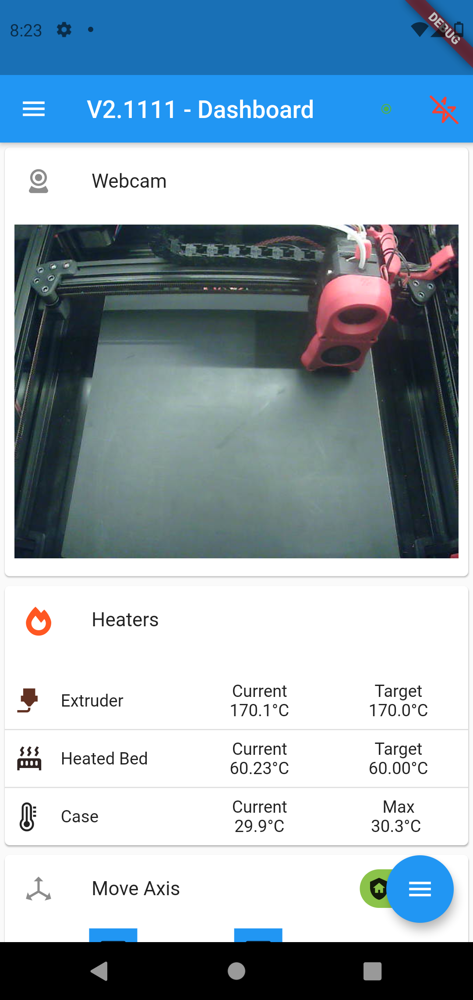
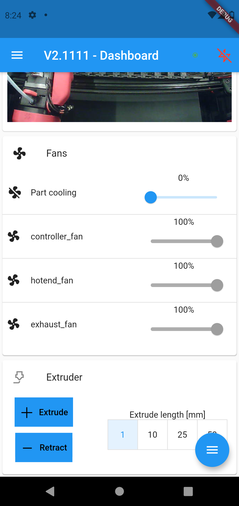

# mobileraker

Mobileraker (working title) is a Flutter app to control a single or multiple 3D printers running Klipper+Moonraker.

Checkout the first release to download an Android APK!

Home           |  More images...
:------------------------------------------------------:|:-------------------------------------------------------:
  |  
  |  

## Planed features
* [x] Support for multiple printers
* [ ] Multiple colors/themes and dark mode
* [ ] Notifications (Might need an klipper addon?)
  * [ ] Print done
  * [ ] Print progress
  * [ ] Klipper errors
* [ ] Overview page
  * [ ] Refactor current layout with multiple and clearer menu-tabs
  * [ ] Add temperature graphs
  * [ ] Add a console
  * [ ] Add mesh selection
  * [ ] Add qery endstops
* [ ] Files(STL) page
  * [ ] Upload stls
  * [ ] Stl preview
  * [ ] Stl viewer
* [ ] Config page
* [ ] Print-statistics/history page

## Getting Started
After importing this project into your IDE be sure to run `flutter packages pub run build_runner build` in order to generate required files!
